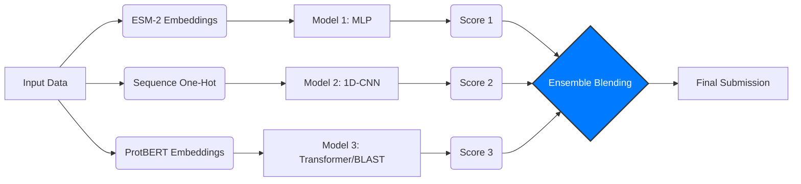

# CAFA 6 Protein Function Prediction - Team 0165_INT34057

## 👥 Thành viên nhóm
* **Lê Trọng Thực** - MSSV: 23020165
---

## 📖 Giới thiệu
Dự án này sử dụng chiến lược **Ensemble 3 luồng (Three-stream Ensemble)** để dự đoán chức năng protein (Gene Ontology). Nhóm kết hợp 3 kiến trúc mô hình học sâu khác nhau để tối ưu hóa độ chính xác và khả năng tổng quát hóa.

### 🏗️ Kiến trúc hệ thống

### 📂 Cấu trúc dự án
- `1_train_models/`: Chứa 3 notebook đại diện cho 3 phương pháp độc lập.
  - `01_ESM2_MLP.ipynb`: Mô hình Deep Learning dựa trên ESM-2 Embeddings (Baseline).
  - `02_1D_CNN.ipynb`: Mô hình CNN 1 chiều để bắt các motif cục bộ.
  - `03_ProtBERT.ipynb`: Mô hình dựa trên ProtBERT Embeddings.
- `2_ensemble/`: Chứa mã nguồn để gộp kết quả.
  - `04_Ensemble_Blending.ipynb`: Tính trung bình có trọng số từ 3 kết quả trên.
- `output/`: Thư mục chứa các file submission (không upload lên GitHub để tiết kiệm dung lượng).

## 🚀 Hướng dẫn chạy (Workflow)
Để tái lập kết quả, cần chạy theo thứ tự sau:

### 1. **Cài đặt thư viện:**
   ```bash
   pip install -r requirements.txt
   ```
### 2. Giai đoạn 1: Huấn luyện & Dự đoán độc lập
Trong giai đoạn này, nhóm chạy 3 notebook riêng biệt để tạo ra 3 bộ dự đoán (submission files) khác nhau. Mỗi notebook đại diện cho một phương pháp tiếp cận đặc thù.

#### 🔹 Model 1: ESM-2 + MLP (Baseline)
* **Notebook:** `1_train_models/01_ESM2_MLP.ipynb`
* **Mô tả:** Sử dụng embeddings từ mô hình ngôn ngữ **ESM-2** (Meta AI) kết hợp với mạng nơ-ron truyền thẳng (MLP - Multi Layer Perceptron) 3 lớp ẩn [1024, 512, 256].
* **Dữ liệu đầu vào:** `cafa-5-ems-2-embeddings-numpy`
* **Đầu ra:** File `output/submission_1.tsv`
* **Điểm đặc biệt:** Nắm bắt tốt ngữ nghĩa toàn cục của protein, đóng vai trò là "xương sống" cho hệ thống Ensemble.

#### 🔹 Model 2: 1D-CNN (Local Motifs)
* **Notebook:** `1_train_models/02_1D_CNN.ipynb`
* **Mô tả:** Sử dụng mạng tích chập 1 chiều (**1D-Convolutional Neural Network**) để quét qua chuỗi protein.
* **Dữ liệu đầu vào:** Tương thích với ESM-2 hoặc ProtBERT embeddings.
* **Đầu ra:** File `output/submission_2.tsv`
* **Điểm đặc biệt:** Mô hình này chuyên biệt trong việc phát hiện các **motif cục bộ** (các đoạn trình tự ngắn lặp lại có chức năng sinh học) mà mô hình MLP có thể bỏ sót.

#### 🔹 Model 3: ProtBERT / Multi-Embedding
* **Notebook:** `1_train_models/03_ProtBERT.ipynb`
* **Mô tả:** Sử dụng embeddings từ **ProtBERT** (Google) hoặc T5 để đa dạng hóa không gian đặc trưng.
* **Dữ liệu đầu vào:** `protbert-embeddings-for-cafa5` hoặc `t5embeds`.
* **Đầu ra:** File `output/submission_3.tsv`
* **Điểm đặc biệt:** Cung cấp góc nhìn khác về dữ liệu (Representation Diversity), giúp giảm thiểu sai số khi ensemble với ESM-2.

---

### 3. Giai đoạn 2: Ensemble (Kết hợp kết quả)
Đây là bước quan trọng nhất để tổng hợp sức mạnh của cả 3 mô hình trên.

* **Notebook:** `2_ensemble/04_Ensemble_Blending.ipynb`
* **Phương pháp:** Weighted Averaging (Trung bình cộng có trọng số).
* **Đầu vào:** 3 file `submission_*.tsv` từ Giai đoạn 1.
* **Công thức:**
    
    $$Score_{Final} = (w_1 \times Score_{MLP}) + (w_2 \times Score_{CNN}) + (w_3 \times Score_{ProtBERT})$$
    
    *Trong đó bộ trọng số được thiết lập là:*
    * $w_1 = 0.5$ (ESM-2 - Mô hình tốt nhất)
    * $w_2 = 0.3$ (1D-CNN)
    * $w_3 = 0.2$ (ProtBERT)

* **Cách chạy:**
    1. Đảm bảo đã có đủ 3 file submission trong thư mục `output/`.
    2. Chạy notebook `04_Ensemble_Blending.ipynb`.
    3. Kết quả cuối cùng sẽ được lưu tại: `output/final_submission.tsv`.

---
**⚠️ Lưu ý về dữ liệu:**
Các notebook trên yêu cầu bộ dữ liệu embeddings rất lớn. Nếu chạy trên máy cá nhân, cần tải các dataset sau từ Kaggle và đặt vào thư mục `input/` (cần cấu hình lại đường dẫn trong code nếu khác biệt):
1. `cafa-5-ems-2-embeddings-numpy`
2. `protbert-embeddings-for-cafa5`
3. `t5embeds`